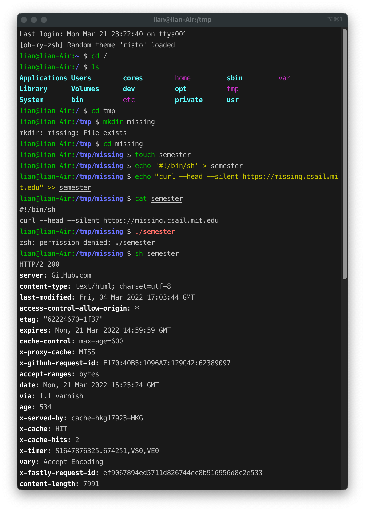
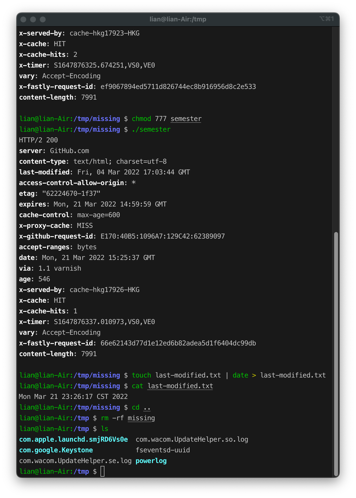

# Course overview + the shell

## Exercise

1. For this course, you need to be using a Unix shell like Bash or ZSH. If you are on Linux or macOS, you don’t have to do anything special. If you are on Windows, you need to make sure you are not running cmd.exe or PowerShell; you can use Windows Subsystem for Linux or a Linux virtual machine to use Unix-style command-line tools. To make sure you’re running an appropriate shell, you can try the command `echo $SHELL`. If it says something like `/bin/bash` or `/usr/bin/zsh`, that means you’re running the right program.
2. Create a new directory called `missing` under `/tmp`.
3. Look up the `touch` program. The `man` program is your friend.
4. Use `touch` to create a new file called `semester` in `missing`.
5. Write the following into that file, one line at a time   :

    ```bash
    \#!/bin/sh 
    curl --head --silent https://missing.csail.mit.edu 
    ```

   The first line might be tricky to get working. It’s helpful to know that `#` starts a comment in Bash, and `!` has a special meaning even within double-quoted (`"`) strings. Bash treats single-quoted strings (`'`) differently: they will do the trick in this case. See the Bash quoting manual page for more information.
6. Try to execute the file, i.e. type the path to the script (`./semester`) into your shell and press enter. Understand why it doesn’t work by consulting the output of `ls` (hint: look at the permission bits of the file).
7. Run the command by explicitly starting the `sh` interpreter, and giving it the file `semester` as the first argument, i.e. `sh semester`. Why does this work, while `./semester` didn’t?
8. Look up the `chmod` program (e.g. use `man chmod`).
9. Use `chmod` to make it possible to run the command `./semester` rather than having to type `sh semester`. How does your shell know that the file is supposed to be interpreted using `sh`? See this page on the shebang line for more information.
10. Use `|` and `>` to write the “last modified” date output by `semester` into a file called `last-modified.txt` in your home directory.
11. Write a command that reads out your laptop battery’s power level or your desktop machine’s CPU temperature from `/sys`. Note: if you’re a macOS user, your OS doesn’t have sysfs, so you can skip this exercise.

## Solution



