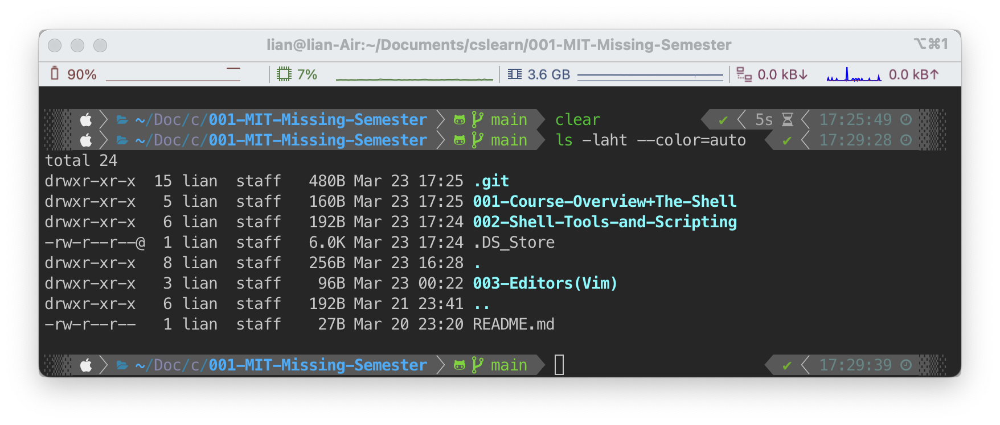
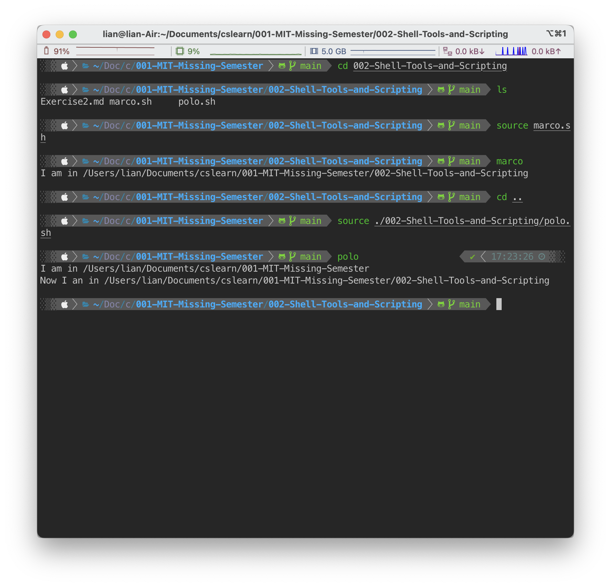

# Shell Tools and Scripting

## Exercise

1. Read `man ls` and write an `ls` command that lists files in the following manner

- Includes all files, including hidden files
- Sizes are listed in human readable format (e.g. 454M instead of 454279954)
- Files are ordered by recency
- Output is colorized
A sample output would look like this

```bash
-rw-r--r--   1 user group 1.1M Jan 14 09:53 baz
drwxr-xr-x   5 user group  160 Jan 14 09:53 .
-rw-r--r--   1 user group  514 Jan 14 06:42 bar
-rw-r--r--   1 user group 106M Jan 13 12:12 foo
drwx------+ 47 user group 1.5K Jan 12 18:08 ..
```

2. Write bash functions `marco` and `polo` that do the following. Whenever you execute `marco` the current working directory should be saved in some manner, then when you execute `polo`, no matter what directory you are in, `polo` should `cd` you back to the directory where you executed `marco`. For ease of debugging you can write the code in a file `marco.sh` and (re)load the definitions to your shell by executing `source marco.sh`.

3. Say you have a command that fails rarely. In order to debug it you need to capture its output but it can be time consuming to get a failure run. Write a bash script that runs the following script until it fails and captures its standard output and error streams to files and prints everything at the end. Bonus points if you can also report how many runs it took for the script to fail.

```bash
 #!/usr/bin/env bash

 n=$(( RANDOM % 100 ))

 if [[ n -eq 42 ]]; then
    echo "Something went wrong"
    >&2 echo "The error was using magic numbers"
    exit 1
 fi

 echo "Everything went according to plan"
 ```

## Solution


