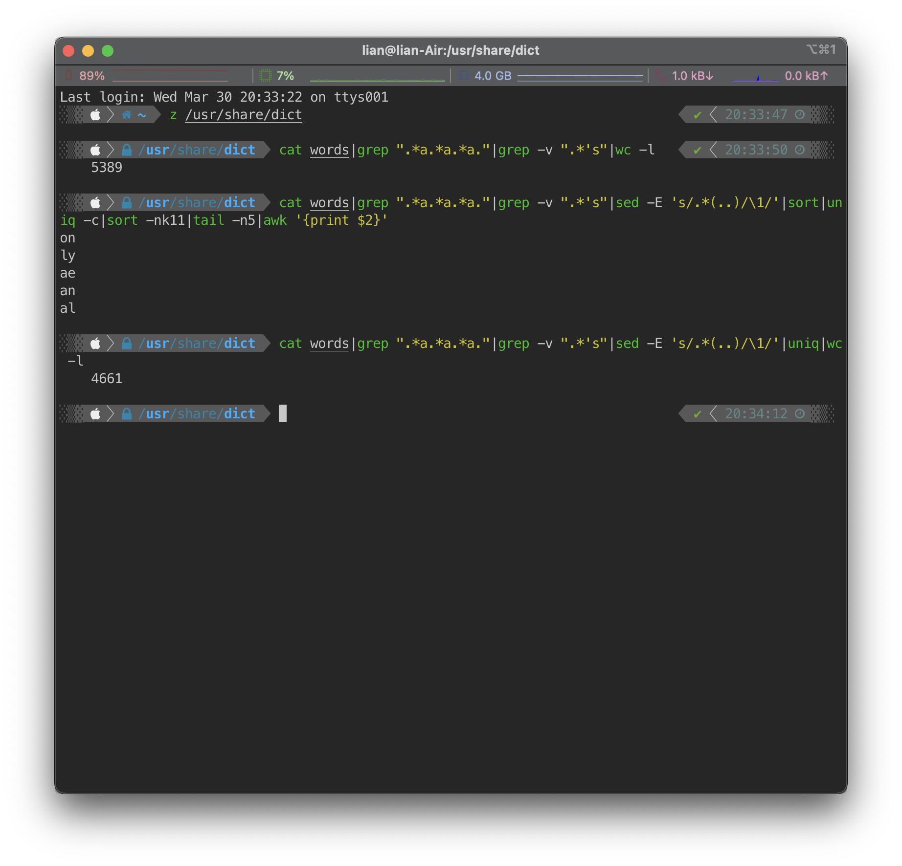

# Data Wrangling

## Exercises

1. Take this [short interactive regex tutorial](https://regexone.com/).
2. Find the number of words (in `/usr/share/dict/words`) that contain at
   least three `a`s and don't have a `'s` ending. What are the three
   most common last two letters of those words? `sed`'s `y` command, or
   the `tr` program, may help you with case insensitivity. How many
   of those two-letter combinations are there? And for a challenge:
   which combinations do not occur?
3. To do in-place substitution it is quite tempting to do something like
   `sed s/REGEX/SUBSTITUTION/ input.txt > input.txt`. However this is a
   bad idea, why? Is this particular to `sed`? Use `man sed` to find out
   how to accomplish this.
4. Find your average, median, and max system boot time over the last ten
   boots. Use `journalctl` on Linux and `log show` on macOS, and look
   for log timestamps near the beginning and end of each boot. On Linux,
   they may look something like:

   ```bash
   Logs begin at ...
   ```

   and

   ```bash
   systemd[577]: Startup finished in ...
   ```

   On macOS, [look
   for](https://eclecticlight.co/2018/03/21/macos-unified-log-3-finding-your-way/):

   ```bash
   === system boot:
   ```

   and

   ```bash
   Previous shutdown cause: 5
   ```

5. Look for boot messages that are _not_ shared between your past three
   reboots (see `journalctl`'s `-b` flag). Break this task down into
   multiple steps. First, find a way to get just the logs from the past
   three boots. There may be an applicable flag on the tool you use to
   extract the boot logs, or you can use `sed '0,/STRING/d'` to remove
   all lines previous to one that matches `STRING`. Next, remove any
   parts of the line that _always_ varies (like the timestamp). Then,
   de-duplicate the input lines and keep a count of each one (`uniq` is
   your friend). And finally, eliminate any line whose count is 3 (since
   it _was_ shared among all the boots).
6. Find an online data set like [this
   one](https://stats.wikimedia.org/EN/TablesWikipediaZZ.htm), [this
   one](https://ucr.fbi.gov/crime-in-the-u.s/2016/crime-in-the-u.s.-2016/topic-pages/tables/table-1),
   or maybe one [from
   here](https://www.springboard.com/blog/free-public-data-sets-data-science-project/).
   Fetch it using `curl` and extract out just two columns of numerical
   data. If you're fetching HTML data,
   [`pup`](https://github.com/EricChiang/pup) might be helpful. For JSON
   data, try [`jq`](https://stedolan.github.io/jq/). Find the min and
   max of one column in a single command, and the difference of the sum
   of each column in another.

## Solution

2. Question(a)

   ```bash
   cd /usr/share/dict
   cat words | grep ".*a.*a.*a" | grep -v ".*'s" | wc -l
   ```

   Question(b)

   ```bash
   cd /usr/share/dict
   cat words | grep ".*a.*a.*a" | grep -v ".*'s" | sed -E 's/.*(..)/\1/' | sort | uniq -c | sort -nk11 | tail -n5 | awk '{print $2}'
   ```

   Question(c)

   ```bash
   cd /usr/share/dict
   cat words | grep ".*a.*a.*a" | grep -v ".*'s" | sed -E 's/.*(..)/\1/' | sort | uniq -c | sort -nk11 | tail -n5 | awk '{print $2}'
   ```
