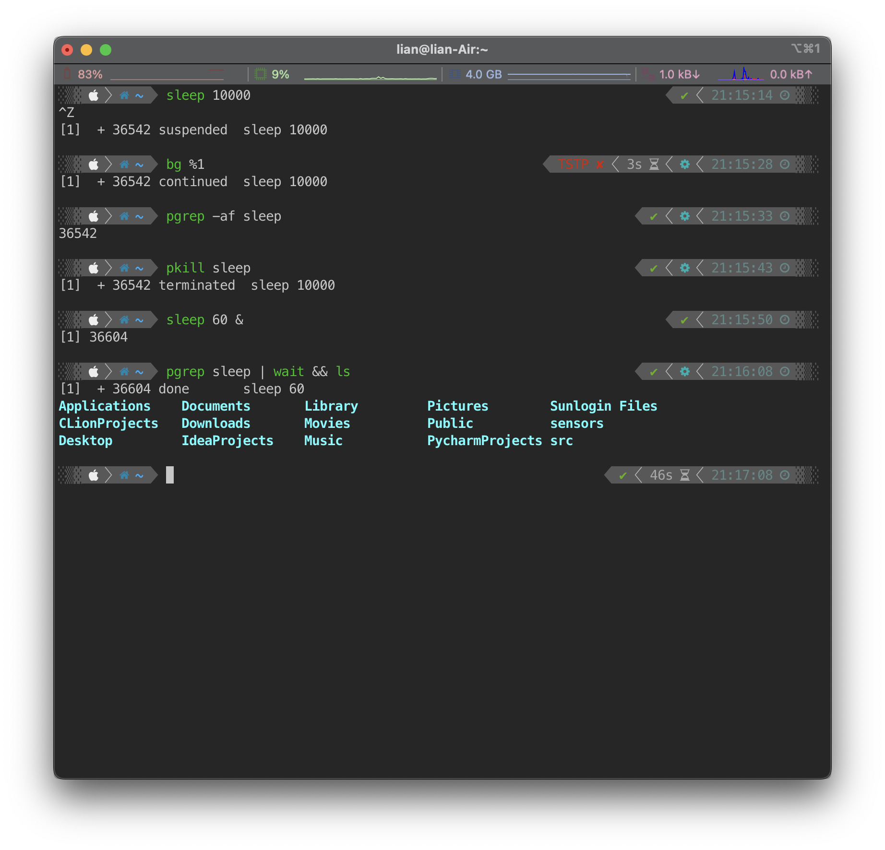

# Command-line Environment

## Exercises

## Job control

1. From what we have seen, we can use some `ps aux | grep` commands to get our jobs' pids and then kill them, but there are better ways to do it. Start a `sleep 10000` job in a terminal, background it with `Ctrl-Z` and continue its execution with `bg`. Now use [`pgrep`](https://www.man7.org/linux/man-pages/man1/pgrep.1.html) to find its pid and [`pkill`](http://man7.org/linux/man-pages/man1/pgrep.1.html) to kill it without ever typing the pid itself. (Hint: use the `-af` flags).

1. Say you don't want to start a process until another completes. How would you go about it? In this exercise, our limiting process will always be `sleep 60 &`.
One way to achieve this is to use the [`wait`](https://www.man7.org/linux/man-pages/man1/wait.1p.html) command. Try launching the sleep command and having an `ls` wait until the background process finishes.

    However, this strategy will fail if we start in a different bash session, since `wait` only works for child processes. One feature we did not discuss in the notes is that the `kill` command's exit status will be zero on success and nonzero otherwise. `kill -0` does not send a signal but will give a nonzero exit status if the process does not exist.
    Write a bash function called `pidwait` that takes a pid and waits until the given process completes. You should use `sleep` to avoid wasting CPU unnecessarily.

