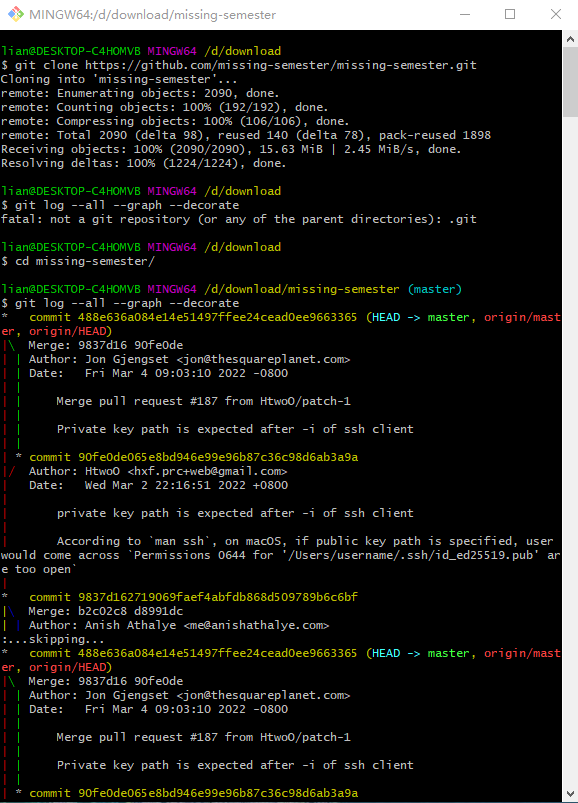

# Version Control(git)
## Exercises

1. If you don't have any past experience with Git, either try reading the first
   couple chapters of [Pro Git](https://git-scm.com/book/en/v2) or go through a
   tutorial like [Learn Git Branching](https://learngitbranching.js.org/). As
   you're working through it, relate Git commands to the data model.
1. Clone the [repository for the
class website](https://github.com/missing-semester/missing-semester).
    1. Explore the version history by visualizing it as a graph.
    1. Who was the last person to modify `README.md`? (Hint: use `git log` with
       an argument).
    1. What was the commit message associated with the last modification to the
       `collections:` line of `_config.yml`? (Hint: use `git blame` and `git
       show`).
1. One common mistake when learning Git is to commit large files that should
   not be managed by Git or adding sensitive information. Try adding a file to
   a repository, making some commits and then deleting that file from history
   (you may want to look at
   [this](https://help.github.com/articles/removing-sensitive-data-from-a-repository/)).
1. Clone some repository from GitHub, and modify one of its existing files.
   What happens when you do `git stash`? What do you see when running `git log
   --all --oneline`? Run `git stash pop` to undo what you did with `git stash`.
   In what scenario might this be useful?
1. Like many command line tools, Git provides a configuration file (or dotfile)
   called `~/.gitconfig`. Create an alias in `~/.gitconfig` so that when you
   run `git graph`, you get the output of `git log --all --graph --decorate
   --oneline`. Information about git aliases can be found [here](https://git-scm.com/docs/git-config#Documentation/git-config.txt-alias).
1. You can define global ignore patterns in `~/.gitignore_global` after running
   `git config --global core.excludesfile ~/.gitignore_global`. Do this, and
   set up your global gitignore file to ignore OS-specific or editor-specific
   temporary files, like `.DS_Store`.
1. Fork the [repository for the class
   website](https://github.com/missing-semester/missing-semester), find a typo
   or some other improvement you can make, and submit a pull request on GitHub
   (you may want to look at [this](https://github.com/firstcontributions/first-contributions)).

## Solution

2.1

   ```bash
   git log -1 --all README.md
   ```

2.2

   ```bash
   git blame _config.yml | grep collections: | awk '{print $1}' | xargs git show | head -n6

   ```



