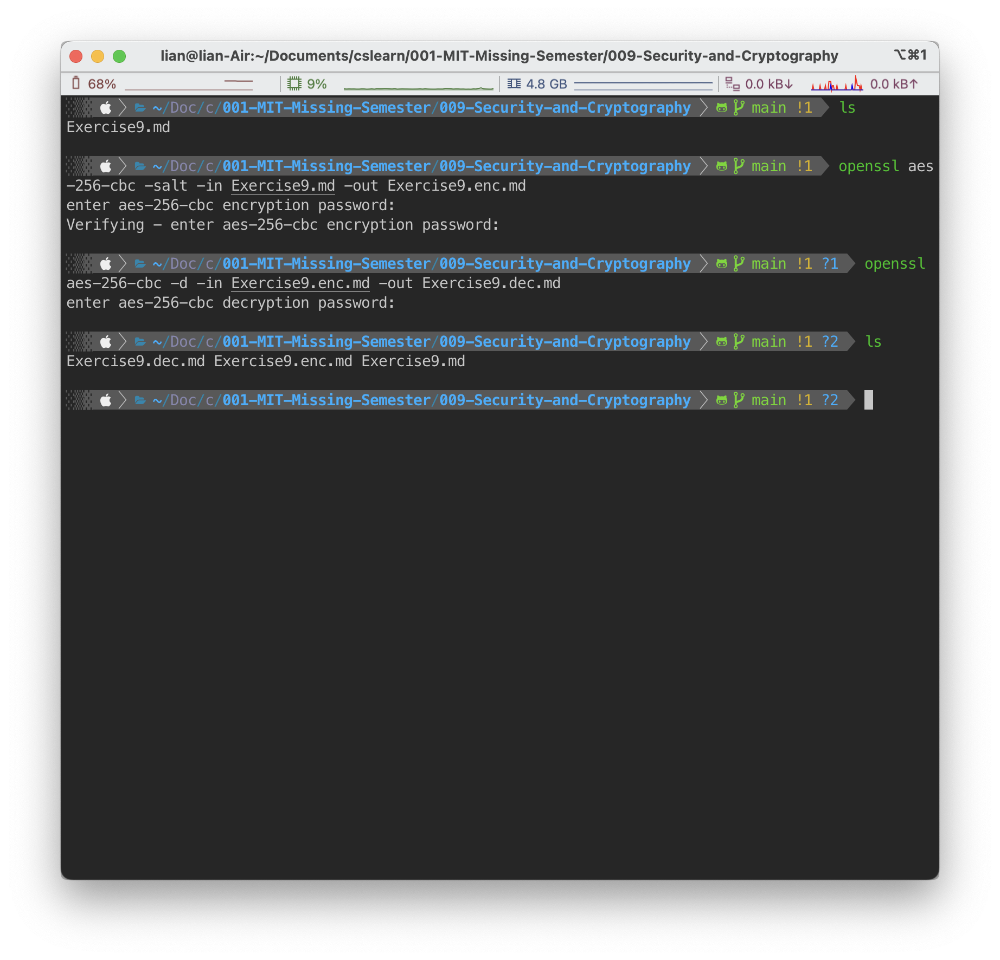

# Security and Cryptography

## Exercises

1. **Entropy.**
    1. Suppose a password is chosen as a concatenation of four lower-case
       dictionary words, where each word is selected uniformly at random from a
       dictionary of size 100,000. An example of such a password is
       `correcthorsebatterystaple`. How many bits of entropy does this have?
    1. Consider an alternative scheme where a password is chosen as a sequence
       of 8 random alphanumeric characters (including both lower-case and
       upper-case letters). An example is `rg8Ql34g`. How many bits of entropy
       does this have?
    1. Which is the stronger password?
    1. Suppose an attacker can try guessing 10,000 passwords per second. On
       average, how long will it take to break each of the passwords?
1. **Cryptographic hash functions.** Download a Debian image from a
   [mirror](https://www.debian.org/CD/http-ftp/) (e.g. [from this Argentinean
   mirror](http://debian.xfree.com.ar/debian-cd/current/amd64/iso-cd/)).
   Cross-check the hash (e.g. using the `sha256sum` command) with the hash
   retrieved from the official Debian site (e.g. [this
   file](https://cdimage.debian.org/debian-cd/current/amd64/iso-cd/SHA256SUMS)
   hosted at `debian.org`, if you've downloaded the linked file from the
   Argentinean mirror).
1. **Symmetric cryptography.** Encrypt a file with AES encryption, using
   [OpenSSL](https://www.openssl.org/): `openssl aes-256-cbc -salt -in {input
   filename} -out {output filename}`. Look at the contents using `cat` or
   `hexdump`. Decrypt it with `openssl aes-256-cbc -d -in {input filename} -out
   {output filename}` and confirm that the contents match the original using
   `cmp`.
1. **Asymmetric cryptography.**
    1. Set up [SSH
       keys](https://www.digitalocean.com/community/tutorials/how-to-set-up-ssh-keys--2)
       on a computer you have access to (not Athena, because Kerberos interacts
       weirdly with SSH keys). Make sure
       your private key is encrypted with a passphrase, so it is protected at
       rest.
    1. [Set up GPG](https://www.digitalocean.com/community/tutorials/how-to-use-gpg-to-encrypt-and-sign-messages)
    1. Send Anish an encrypted email ([public key](https://keybase.io/anish)).
    1. Sign a Git commit with `git commit -S` or create a signed Git tag with
       `git tag -s`. Verify the signature on the commit with `git show
       --show-signature` or on the tag with `git tag -v`.

## Solution

3. ```bash
   openssl aes-256-cbc -salt -in Exercise9.md -out Exercise9.enc.md  #encryption
   openssl aes-256-cbc -d -in Exercise9.enc.md -out Exercise9.dec.md  #decryption
   ```

